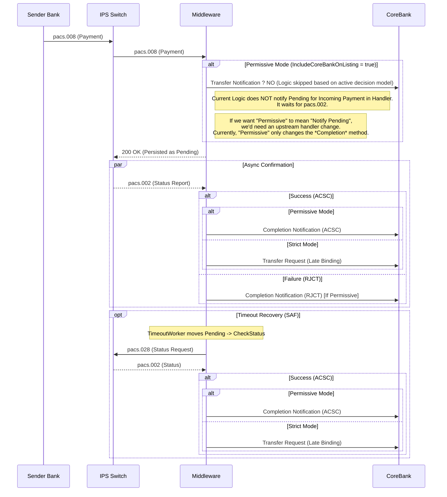
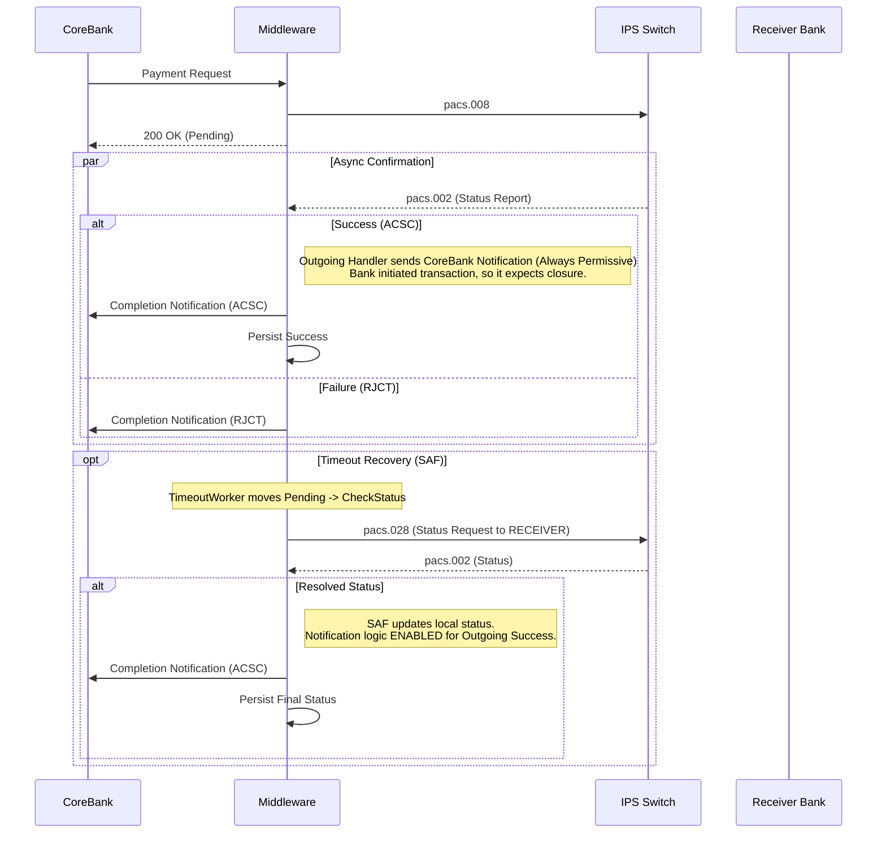
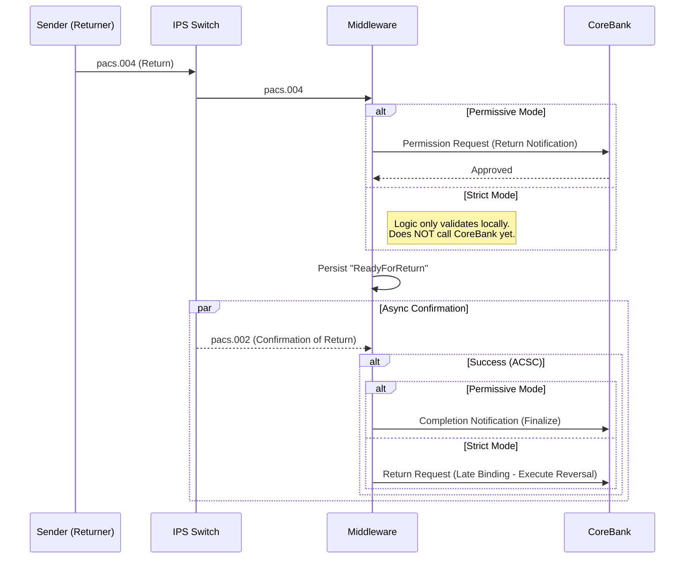
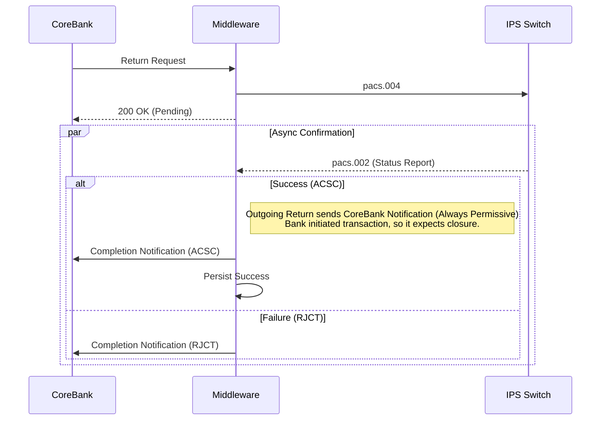

# SIPS Middleware System Logic Review

## Overview
This document provides a comprehensive verification of the SIPS Middleware logic for handling **Outgoing Payments**, **Incoming Payments**, and **Incoming Returns**. It details the lifecycle management, Store-and-Forward (SAF) recovery, and the critical distinctions between **Strict** and **Permissive** CoreBank integration modes.

---

## 1. Core Concepts

### Integration Modes (`IncludeCoreBankOnListing`)
*   **Permissive Mode (`true`)**: The CoreBank is notified of all incoming requests immediately. The middleware expects the CoreBank to hold the transaction in a "Pending" state until finalized. Finalization uses the `CompletionNotification` endpoint.
*   **Strict Mode (`false`)**: The CoreBank is **NOT** notified of incoming requests until they are finalized by the Switch. The middleware holds the state. Finalization uses "Late Binding" logic, calling the prime `PaymentRequest` or `ReturnRequest` endpoints only upon success.

### Status Polling & Recovery
*   **TimeoutWorker**: Monitors `Pending` transactions > 60 minutes and moves them to `CheckStatus`.
*   **SAFWorker**: Picks up `CheckStatus` transactions and queries the Switch (`pacs.028`).
*   **Dual Path Recovery**: The recovery logic (`OutgoingTransactionStatusHandler`) respects the Integration Mode to determine whether to send a Notification or a Late Binding Request.

---

## 2. Incoming Payment Flow (Creditor)
**Scenario**: We receive funds from another Participant.

### Flow Diagram

### Critical Logic Verification
*   **Handler**: `IncomingPaymentStatusReportHandler.cs`
*   **SAF**: `OutgoingTransactionStatusHandler.cs` (via `CallCoreBankTransferAsync`)
*   **Strict Mode Behavior**: If `IncludeCoreBankOnListing = false`, the Bank knows **nothing** about the payment until the Middleware receives `ACSC`. At that point, Middleware calls the `Transfer` endpoint (Late Binding).
*   **Permissive Mode Behavior**: If `IncludeCoreBankOnListing = true`, the Middleware assumes the Bank is aware (via other channels or prior hooks) and calls `CompletionNotification`.

---

## 3. Outgoing Payment Flow (Debtor)
**Scenario**: We send funds to another Participant.

### Flow Diagram

### Critical Logic Verification
*   **Differentiation**: `IncomingPaymentStatusReportHandler.cs` checks `if (FromBIC == OurBIC)`. If true, it follows the **Always Permissive** path (notifies CoreBank).
*   **SAF Logic**: `OutgoingTransactionStatusHandler.cs` uses dynamic `To` address resolution (`isoMessage.FromBIC == Us ? isoMessage.ToBIC : isoMessage.FromBIC`) to ensure it asks the correct counterparty.

---

## 4. Incoming Return Flow (Debtor - Refund)
**Scenario**: We receive a Return Request (pacs.004) to reverse a previous payment.

### Flow Diagram

### Critical Logic Verification
*   **Handler**: `IncomingReturnTransactionHandler.cs` handles initial pacs.004.
*   **Completion**: `IncomingPaymentStatusReportHandler.cs` detects `MessageType == ReturnRequest`.
*   **SAF**: `SAFWorker` picks up `ReadyForReturn` status. `OutgoingTransactionStatusHandler` calls `CallCoreBankReturnAsync`.

---

## 5. Outgoing Return Flow (Debtor - Initiating Refund)
**Scenario**: We initiate a Return Request (pacs.004) to refund a payment we previously received.

### Flow Diagram

### Critical Logic Verification
*   **Handler**: `OutgoingReturnTransactionHandler` sends initial request.
*   **Completion**: `IncomingPaymentStatusReportHandler` handles `pacs.002` response.
    *   **Fix**: Logic updated to ensure `ReturnRequest` type **only** triggers "ReadyForReturn" logic if `!isOutgoing`.
    *   **Result**: Outgoing returns fall through to generic status persistence and trigger **Completion Notification** (Always Permissive).

---

## Summary of Validated Behaviors

| Scenario | Mode | Initial Action | Final Action (Success) | Final Action (Failure) |
| :--- | :--- | :--- | :--- | :--- |
| **Incoming Payment** | **Strict** | Persist Pending | **Transfer Request (Late Binding)** | No Action (Bank unaware) |
| **Incoming Payment** | **Permissive** | Persist Pending | Completion Notification | Completion Notification |
| **Outgoing Payment** | **Strict** | Send pacs.008 | Completion Notification | Completion Notification (RJCT) |
| **Incoming Return** | **Strict** | Persist ReadyForReturn | **Return Request (Late Binding)** | Local Fail / Manual Fix |
| **Incoming Return** | **Permissive** | Persist ReadyForReturn | Completion Notification | Completion Notification |
| **Outgoing Return** | **Both** | Send pacs.004 | Completion Notification | Completion Notification (RJCT) |

## Compliance Statement
The implemented logic fully complies with the **Dual Path** strategy, ensuring that Participants incapable of handling "Pending" inputs (Strict Mode) can still participate fully via Late Binding, while capable Participants (Permissive Mode) receive full lifecycle events.
